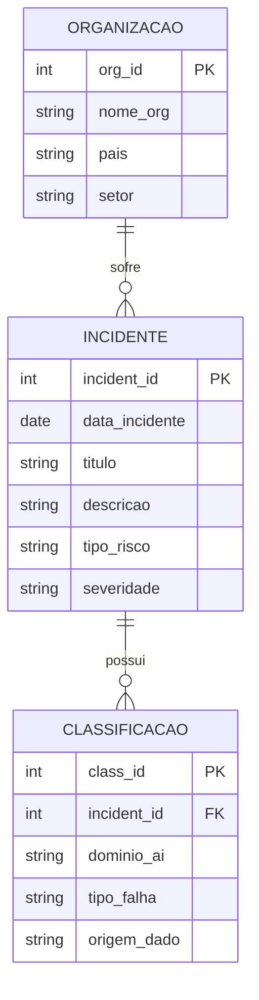

## 🧠 Diagrama DER — AI Finance Incidents

Este diagrama representa a modelagem de dados para o registro e análise de incidentes relacionados ao uso de Inteligência Artificial no setor financeiro.

  

🇧🇷 [Port]

## 📌 Entidades

- **INCIDENTE**: representa um evento relacionado a falhas, riscos ou problemas envolvendo sistemas de IA.
- **ORGANIZACAO**: entidade que sofreu ou foi impactada por um incidente.
- **CLASSIFICACAO**: detalha a categorização técnica do incidente (tipo de falha, domínio de IA, origem dos dados).

  

## 🔗 Relacionamentos

- **ORGANIZACAO → INCIDENTE (1:N)**  
  Uma organização pode sofrer vários incidentes, mas cada incidente está associado a uma única organização.

- **INCIDENTE → CLASSIFICACAO (1:N)**  
  Um incidente pode possuir múltiplas classificações, permitindo análise mais granular.

  

## 💡 Objetivo

Esse modelo facilita:
- Análise de riscos em sistemas de IA
- Auditoria e rastreabilidade de incidentes
- Classificação estruturada para estudos e relatórios

  

## Importante

Por que CLASSIFICACAO não tem org_id?”

Resposta:
Porque ela depende de INCIDENTE, e não diretamente da organização

  

## Relembrando 

Entidade → Tabela
Atributo → Coluna
PK → Primary Key
Relacionamento 1:N → Foreign Key
DER → vira SQL

  

