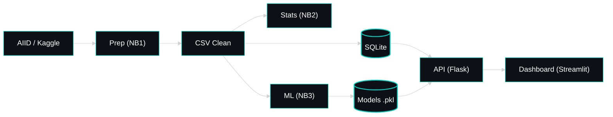

<!-- ======================================= ⚡️ Start DEFAULT HEADER ===========================================  -->

<!-- ========= START LANGUAGE BUTTON ========= -->
 

**\[[🇧🇷 Português](README.pt_BR.md)\] \[**[🇬🇧 English](README.md)**\]**

  
<!-- ========= END LANGUAGE BUTTON ========= -->

<!-- ========= START REPO TITLE ========= -->

# 
 🔐 [AI Incidents in Banking, Financial Services and Fintech]()

###  
 An Analysis of Algorithmic Bias, Operational Risk and Governance for Regulatory Compliance

  
<!-- ========= END REPO TITLE ========= -->

<!-- ========= START Institucional INFO ========= -->
## [Cybersecurity and Social Engineering Integrated Project - PUC-SP 5th Semester (2026)]()

 

[**Institution:**]() Pontifical Catholic University of São Paulo (PUC‑SP – Humanistic AI & Data Science • 5º Semester • 2026)  
[**School:**]() FACEI – Faculty of Interdisciplinary Studies  
[**Course:**]() AI Security, Cybersecurity & Social Engineering  
[**Professor:**]() [✨ Eduardo Savino Gomes]()  
[**Context:**]() This project analyzes real-world AI incidents in banking, financial services and fintech through the lenses of AI security, cybersecurity, social engineering, governance and regulatory compliance.

    
<!-- ========= END Institucional INFO ========= -->

<!-- ========= START BADGES ========= -->

  
  
  
  
  

  

  
<!-- ========= END START BADGES ========= -->

The project is aligned with the course because it examines AI not only as a computational tool, but as a socio-technical risk layer embedded in highly regulated financial systems. In this context, failures in AI-driven applications such as credit scoring, fraud detection, trading systems and automated decision-making may generate algorithmic bias, operational disruption, regulatory exposure and harm to customers.

Its connection with [**AI Security**]() lies in the need to monitor, evaluate and govern AI systems as critical assets. Its connection with **Cybersecurity** emerges from the broader perspective of resilience, data protection, operational control and incident response in adversarial financial environments. Its relationship with [**Social Engineering**]() appears in the ways AI can intensify manipulation, impersonation and trust-related risks in digital finance. Together, these dimensions justify the project’s focus on governance and regulatory compliance as central mechanisms for reducing AI-related risk.

  

#

  

<!-- ========= START Confidentiality statement ========= -->

> [!NOTE]
> 
> ⚠️ Heads Up
>
> * Projects and deliverables may be made [publicly available]() whenever possible.
>   
> * The course emphasizes [**practical, hands-on experience**]() with real datasets to simulate professional consulting scenarios in the fields of **Machine Learning and Neural Networks** for partner organizations and institutions affiliated with the university.
>   
> * All activities comply with the [**academic and ethical guidelines of PUC-SP**]().
>   
> * Any content not authorized for public disclosure will remain [**confidential**]() and securely stored in [private repositories]().  
>  
>
>

   

#

  
<!-- ========= END Confidentiality statement  ========= -->

<!-- ========= START Main Repo REFERENCE  ========= -->
> [!TIP]
>
> This repository is part of the flagship project:
> **🔐 Cybersecurity, Social Engineering & AI Security — Main Hub**
>
> Explore the complete ecosystem of materials, analyses, and notebooks in the central repository:
>
> * 🔗 **[Cybersecurity, Social Engineering & AI Security — Main Hub Repository](https://github.com/Quantum-Software-Development/1-Cybersecurity-SocialEngineering_Main_Hub_Repository-PUCSP)**
>
> *Part of the Humanistic AI Data Modeling Series — where data connects with human insight… and occasionally gets socially engineered. ⚡️

    
<!-- ========= END Main Repo REFERENCE  ========= -->

<!-- ======================================= END DEFAULT HEADER ⚡️ ===========================================  -->

## Table of Contents

1. [Introduction](#1-introduction)
2. [Objectives and Research Questions](#2-objectives-and-research-questions)
3. [Business Context and Data Foundation](#3-business-context-and-data-foundation)
4. [Methodology — CRISP-DM](#4-methodology--crisp-dm)
5. [Data Sources and Preparation](#5-data-sources-and-preparation)
6. [Key Variables and Hypotheses](#6-key-variables-and-hypotheses)
7. [Statistical and AI/ML Methods](#7-statistical-and-aiml-methods)
8. [Project Architecture — 5 Notebooks](#8-project-architecture--5-notebooks)
9. [Database Design and REST API Layer](#9-database-design-and-rest-api-layer)
10. [Key Findings](#10-key-findings)
11. [Timeline, Deliverables, and Business Alignment](#11-timeline-deliverables-and-business-alignment)
12. [Installation and Execution Guide](#12-installation-and-execution-guide)
13. [Project Structure](#13-project-structure)
14. [Limitations and Risk Considerations](#14-limitations-and-risk-considerations)
15. [Conclusion and Next Steps](#15-conclusion-and-next-steps)
16. [References](#16-references)

  

## 1. Introduction

 

### 1.1 Business Context

The adoption of Artificial Intelligence (AI) in banking and financial services has expanded significantly across critical domains such as credit scoring, fraud detection, algorithmic trading, risk management, and customer operations.

While these systems improve efficiency and decision-making speed, they also introduce material risks related to **model bias**, **operational failures**, and **governance gaps**. For financial institutions, these risks translate directly into **regulatory exposure, reputational damage, and financial loss**.

This project analyzes real-world AI incident reports to support a structured understanding of how these risks emerge in financial environments, with a focus on **risk patterns, affected customer groups, and governance response effectiveness**.

 

### 1.2 Business Problem

Given a dataset of AI-related incidents filtered for the financial sector, this project addresses the following business questions:

- Are there **recurring risk patterns** associated with specific AI use cases (credit, fraud, trading)?
- Do certain **customer segments experience disproportionate impact** from AI-driven decisions?
- Are **governance and regulatory responses aligned with incident severity and risk level**?

 

### 1.3 Business Value for Financial Institutions

 

| Stakeholder | Business Value |
|---|---|
| Banks and Financial Institutions | Improved operational risk control and reduced exposure to model failures |
| Regulators | Data-driven supervision and better risk monitoring capabilities |
| Risk Management Teams | Enhanced visibility of AI-related operational risks |
| Compliance Departments | Identification of governance gaps and audit prioritization |
| Executive Leadership | Better understanding of AI risk impact on business performance and reputation |

  

> [!Note]
>
> This project demonstrates how AI incident data can be transformed into actionable risk indicators, predictive models, and API-driven monitoring systems, enabling continuous oversight and improved governance in financial environments.
>
>  
>

  

  

## System Architecture (MLOps Design)

 

  
  
  
  
  
  

<!-- ======================================= Start DEFAULT Footer ===========================================  -->
  

## 💌 [Let the data flow... Ping Me !](mailto:fabicampanari@proton.me)

 

#### 
  🛸๋ My Contacts [Hub](https://linktr.ee/fabianacampanari)

 

### 
 

  

  ────────────── ⊹🔭๋ ──────────────

<!--

  ────────────── 🛸๋*ੈ✩* 🔭*ੈ₊ ──────────────
-->

 

 ➣➢➤ <a href="#top">Back to Top </a>
  

  
#
 
##### 
 Copyright 2026 Quantum Software Development. Code released under the  [MIT license.](https://github.com/Mindful-AI-Assistants/CDIA-Entrepreneurship-Soft-Skills-PUC-SP/blob/21961c2693169d461c6e05900e3d25e28a292297/LICENSE)

