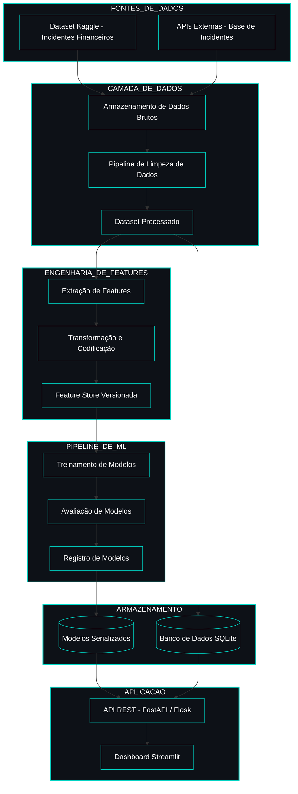

<!-- ======================================= ⚡️ Start DEFAULT HEADER ===========================================  -->

<!-- ========= START LANGUAGE BUTTON ========= -->
 

**\[[🇧🇷 Português](README.pt_BR.md)\] \[**[🇬🇧 English](README.md)**\]**

  
<!-- ========= END LANGUAGE BUTTON ========= -->

<!-- ========= START REPO TITLE ========= -->
# 
 🔐 [Incidentes de IA em Bancos, Serviços Financeiros e Fintechs]()

### 
 Uma Análise de Viés Algorítmico, Risco Operacional e Governança para Conformidade Regulatória

    
<!-- ========= END REPO TITLE ========= -->

<!-- ========= Start Dashboard ========= -->

  

  
<!-- ========= END DashBoar -->

<!-- ========= START Institucional INFO ========= -->

 

[**Projeto Integrador — 5º Semestre | PUC-SP**]()
[**Institution:**]() Pontifical Catholic University of São Paulo  – Humanistic AI & Data Science 
[**Disciplina**:]()  Segurança Cibernética e Engenharia Social · Sistemas Distribuídos e Aprendizagem de Máquina  
[**Course Repo:**]() INTEGRATED PROJECT: Cybersecurity and Social Engineering
[**Metodologia**:]()  CRISP-DM · **Fonte de Dados**: AI Incident Database (AIID)
[**Professor:**]()  [✨ Eduardo Savino Gomes]()

  

#

  
<!-- ========= END Institucional INFO ========= -->

<!-- ========= START BADGES ========= -->

##  [Visão executiva]()

Este projeto consolida uma visão ponta a ponta sobre incidentes de IA em serviços financeiros, conectando dados públicos do AI Incident Database (AIID) a um pipeline completo de análise, modelagem e exposição via API e dashboard. Do ponto de vista executivo, o trabalho mostra como incidentes dispersos podem ser transformados em indicadores estruturados de risco, com foco em viés algorítmico, risco operacional e respostas de governança, consumidos por um dashboard interativo que lê diretamente a API.

A solução é organizada segundo o referencial **CRISP‑DM**, tratado aqui como modelo de projeto de negócio baseado em dados: partimos de *Business Understanding* (problema, escopo financeiro e questões de risco/compliance), passamos por *Data Understanding* e *Data Preparation* (construção da base temática de incidentes), avançamos para *Modeling* e *Evaluation* (modelos supervisionados e testes de hipóteses) e chegamos ao *Deployment* em uma arquitetura com banco relacional, API RESTful e camada de apresentação.

Além da camada analítica tradicional, o projeto foi desenhado para incorporar uma interface conversacional integrada a modelos da OpenAI/ChatGPT, permitindo que usuários não técnicos interajam com os resultados por meio de linguagem natural, façam perguntas sobre os incidentes e explorem os dados sem precisar conhecer detalhes de SQL, estatística ou machine learning.

A principal contribuição está menos em um modelo “pronto para produção” e mais na arquitetura analítica integrada: da aquisição dos dados à disponibilização de endpoints RESTful e de uma camada de visualização e interação, respeitando limitações da base e deixando claro que, nas condições atuais, os modelos devem ser tratados como prova de conceito, não como ferramenta decisória final.

  

<!-- ========= START Confidentiality statement ========= -->

> [!IMPORTANT]
> 
> ⚠️ Heads Up
>
> * Projects and deliverables may be made [publicly available]() whenever possible.
>   
> * The course emphasizes [**practical, hands-on experience**]() with real datasets to simulate professional consulting scenarios in the fields of **Machine Learning and Neural Networks** for partner organizations and institutions affiliated with the university.
>   
> * All activities comply with the [**academic and ethical guidelines of PUC-SP**]().
>   
> * Any content not authorized for public disclosure will remain [**confidential**]() and securely stored in [private repositories]().  
>  
>
>

   

#

  
<!-- ========= END Confidentiality statement  ========= -->

<!-- ========= START Main Repo REFERENCE  ========= -->
> [!TIP]
>
> This repository is part of the flagship project:
> **🔐 Cybersecurity, Social Engineering & AI Security — Main Hub**
>
> Explore the complete ecosystem of materials, analyses, and notebooks in the central repository:
>
> * 🔗 **[Cybersecurity, Social Engineering & AI Security — Main Hub Repository](https://github.com/Quantum-Software-Development/1-Cybersecurity-SocialEngineering_Main_Hub_Repository-PUCSP)**
>
> *Part of the Humanistic AI Data Modeling Series — where data connects with human insight… and occasionally gets socially engineered. ⚡️

    
<!-- ========= END Main Repo REFERENCE  ========= -->

<!-- ======================================= END DEFAULT HEADER ⚡️ ===========================================  -->

  

## Table of Contents

1. [Introdução](#1-introdução)  
2. [Objetivos e Questões de Pesquisa](#2-objetivos-e-questões-de-pesquisa)  
3. [Fundamentação e Contexto dos Dados](#3-fundamentação-e-contexto-dos-dados)  
4. [Metodologia CRISP-DM](#4-metodologia-crisp-dm)  
5. [Dados Utilizados e Preparação](#5-dados-utilizados-e-preparação)  
6. [Variáveis Analíticas e Hipóteses](#6-variáveis-analíticas-e-hipóteses)  
7. [Análise Estatística e Resultados Inferenciais](#7-análise-estatística-e-resultados-inferenciais)  
8. [Modelagem de Machine Learning](#8-modelagem-de-machine-learning)  
9. [Banco de Dados Relacional e API RESTful](#9-banco-de-dados-relacional-e-api-restful)  
10. [Dashboard Interativo](#10-dashboard-interativo)  
11. [Arquitetura do Projeto](#11-arquitetura-do-projeto)  
12. [Estrutura Técnica dos Notebooks](#12-estrutura-técnica-dos-notebooks)  
13. [Resultados Consolidados](#13-resultados-consolidados)  
14. [Limitações, Riscos e Cuidados Metodológicos](#14-limitações-riscos-e-cuidados-metodológicos)  
15. [Guia de Execução](#15-guia-de-execução)  
16. [Estrutura de Arquivos](#16-estrutura-de-arquivos)  
17. [Dependências](#17-dependências)  
18. [Conclusões e Próximos Passos](#18-conclusões-e-próximos-passos)  
19. [Referências](#19-referências)

  

## 1. [Introdução]()

 

### [1.1]() ***Contextualização do tema***

O uso de sistemas de Inteligência Artificial (IA) no setor financeiro cresceu de forma acelerada em aplicações como concessão de crédito, detecção de fraude, *trading* algorítmico, avaliação de risco e automação de atendimento. Esse avanço cria oportunidades de eficiência e inovação, mas também amplia superfícies de **risco operacional**, **viés algorítmico** e **falhas de governança** em ambientes altamente regulados.

Este projeto parte de incidentes reais de IA documentados em diferentes organizações para construir uma visão estruturada de como esses riscos se manifestam em serviços financeiros, com foco em **viés algorítmico**, **risco operacional** e **respostas de governança** em bancos e fintechs.

 

### [1.2]() ***Problema de pesquisa***

Dado um conjunto de incidentes de IA registrados em múltiplos setores e filtrados para o domínio financeiro, o problema central é avaliar se:

- existem **padrões sistemáticos** de viés e risco associados a certos tipos de aplicação de IA (crédito, fraude, *trading*);
- determinados **segmentos de clientes** são desproporcionalmente afetados;
- **respostas de governança** e de reguladores acompanham adequadamente a gravidade dos incidentes.

 

### [1.3]() ***Relevância para o setor financeiro e para a governança de IA***

 

| [Stakeholder]() | [Benefício Direto]() |
|---|---|
| [**Bancos e Fintechs**]() | Aprimorar gestão de risco operacional e reputacional |
| [**Reguladores**]() | Supervisão baseada em dados e evidências quantitativas |
| [**Gestores de Risco**]() | Ferramentas para avaliar exposição a incidentes de IA |
| [**Compliance**]() | Identificar lacunas regulatórias e priorizar auditorias |
| [**Investidores**]() | Entender impacto de incidentes de IA no valor de instituições |

  

> [!TIP]
>
> Para a [**governança de IA**](), o projeto ilustra como dados de incidentes podem ser transformados em indicadores, modelos preditivos e APIs, viabilizando monitoramento contínuo e respostas estruturadas a riscos.
>
>  

  

# Sistema de Inteligência de Incidentes Financeiros com IA  
## Arquitetura do Sistema (Design MLOps)

 

  
  
  
  
  
  

<!-- ======================================= Start DEFAULT Footer ===========================================  -->
  

## 💌 [Let the data flow... Ping Me !](mailto:fabicampanari@proton.me)

 

#### 
  🛸๋ My Contacts [Hub](https://linktr.ee/fabianacampanari)

 

### 
 

  

  ────────────── ⊹🔭๋ ──────────────

<!--

  ────────────── 🛸๋*ੈ✩* 🔭*ੈ₊ ──────────────
-->

 

 ➣➢➤ <a href="#top">Back to Top </a>
  

  
#
 
##### 
 Copyright 2026 Quantum Software Development. Code released under the  [MIT license.](https://github.com/Mindful-AI-Assistants/CDIA-Entrepreneurship-Soft-Skills-PUC-SP/blob/21961c2693169d461c6e05900e3d25e28a292297/LICENSE)

